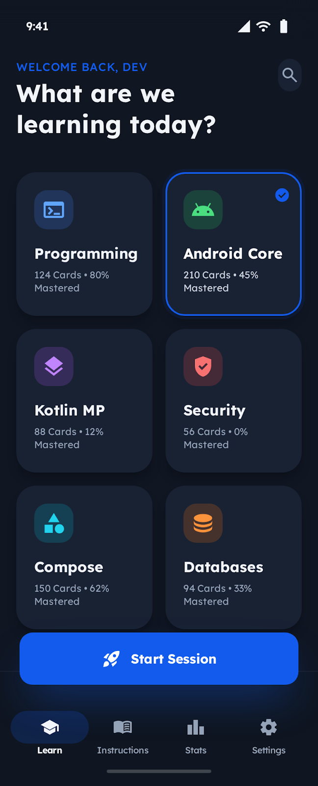
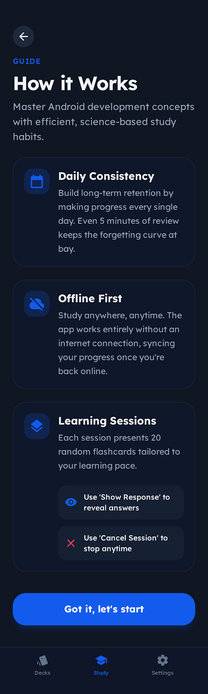
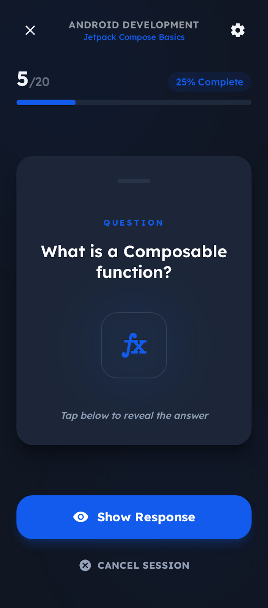
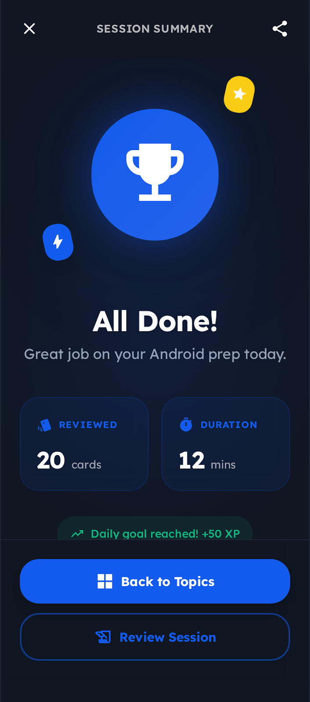

# Flashcards-2

Welcome to my **Fashcards 2** project!  
I'm trying to create a new version of Flashcards with everything I learned so far. Originally, Flashcards is a small personal project to show a set of flashcards to study about Android and Kotlin. In fact, all the falshcards are grouped by topics

---

## 📱 About the Project

- Practice building modern UIs with **Jetpack Compose**.
- Replicate **popular app designs** and **UI challenges**.
- Showcase how Compose can simplify and enhance Android development.

---

## 🎯 Goals

- Strengthen my understanding of **Jetpack Compose**.
- Build a collection of reusable **UI components**.
- Demonstrate Compose’s flexibility in replicating **real-world app designs**.
- Encourage developers to adopt Compose for **cross-platform projects**.

---

## 🛠️ Tech Stack

- **Kotlin**  
- **Jetpack Compose**
- **Compose Navigation 3**
- **Android Studio**  

---

## 📸 Screenshots

All the designs are provided by Google Stitch 
<table>
  <tr>
    <td><b>Deck List (Home)</b></td>
    <td><b>Instructions</b></td>
  </tr>
  <tr>
    <td></td>
    <td></td>
  </tr>
  <tr>
    <td><b>Flashcard</b></td>
    <td><b>Summary</b></td>
  </tr>
  <tr>
    <td></td>
    <td></td>
  </tr>
  
  
</table>

---

## 🤝 Contributing

This is a personal practice project, but contributions, ideas, and suggestions are welcome! Feel free to open issues or submit pull requests.

---

## 📢 Disclaimer

This project is for educational purposes only. All replicated designs are inspired by existing apps and UI challenges, but no proprietary assets or code are used.

---

## ⭐ Support

If you find this project helpful or inspiring:

- Give it a ⭐ on GitHub
- Share it with other developers exploring Jetpack Compose

---

## 📚 Resources

- **Jetpack Compose Documentation**
- **Jetpack Compose**
- **Compose Navigation 3**
- **Android Developers YouTube**  

---
