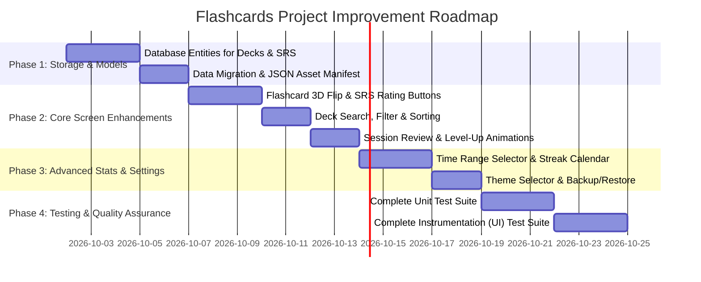

# Flashcards Application - Project Improvement & Feature Plan

## Executive Summary & Architecture Overview

The **Flashcards-2** application is an Android flashcard learning platform built with modern Android development practices:
- **UI & Navigation:** Jetpack Compose, Material 3, Navigation 3, Vico Charts, Konfetti.
- **Architecture & DI:** Clean Architecture, MVVM with `StateFlow`/`UiState`, Koin.
- **Storage & Data:** Room Database (`AppDatabase`, `FlashcardDao`, `StudyDao`, `SessionSummaryDao`), DataStore Preferences (`LocalSettingsRepository`), Asset JSON files (`assets/decks/*.json`).
- **Background Tasks:** WorkManager (`ReminderScheduler`, `ReminderWorker`).

This plan provides a comprehensive audit of each screen and data layer, identifying:
1. **Hardcoded or static information** that should be dynamically computed, stored in Room DB, or loaded from JSON assets.
2. **Missing features** to enhance user learning, deck management, and app usability.
3. **Missing unit and instrumentation (UI) tests** to achieve thorough test coverage.

---

## 1. Screen-by-Screen Feature & Data Analysis

### A. Deck List Screen (`DeckListScreen.kt`)

#### Current State
Displays a 2-column grid of flashcard decks loaded via `LocalDeckRepository`. Supports deck selection, empty deck detection, and quick start via double-tap or button click.

#### Hardcoded Data to Replace
- **Hardcoded Deck Metadata:** `LocalDeckRepository.kt` defines a hardcoded `listOf(Deck(...))` containing 20 static deck definitions (IDs 1–20).
  - *Improvement:* Move deck metadata (ID, name, description, category, icon resource) to a Room `decks` entity or a central `decks.json` manifest file in assets.
- **Hardcoded Icon & Description Mapping:** `DeckAssets.getIconForDeck()` and `DeckAssets.getDescriptionForDeck()` use hardcoded `when (deckId)` statements.
  - *Improvement:* Store icon identifiers and string resource names in database/JSON data models.

#### Missing Features
- 🔍 **Deck Search & Filter Bar:** Search decks by name, description, or topic. Filter by category (e.g., Android, Kotlin, Architecture, Cloud).
- 🔃 **Deck Sorting Options:** Sort decks by mastery percentage, last studied date, card count, or alphabetically.
- ➕ **Custom Deck Creation & Editing:** Allow users to create custom decks, add/edit/delete flashcards, and persist them in Room DB.
- 📥 **Deck Import / Export:** Import custom decks from JSON/CSV files or export user progress.

#### Missing Unit & Instrumentation Tests
- **Unit Tests (`LocalDeckRepositoryTest`):**
  - Verify mapping of deck mastery levels when `session_summaries` or `deck_mastery` table is empty vs populated.
  - Verify card count calculations when JSON assets are present vs missing.
- **Instrumentation Tests (`DeckListScreenTest`):**
  - UI test for double-tap Quick Start popup behavior when `quickStart` setting is enabled vs disabled.
  - UI test for empty deck dialog triggering and dismissal.
  - UI test for deck grid scrolling and selecting different decks.

---

### B. Flashcard Session Screen (`FlashcardScreen.kt`)

#### Current State
Presents flashcards in a `HorizontalPager` with a progress bar, question/answer cards, and session timer. Supports showing answers, lifecycle-aware timer pausing/resuming, and cancellation confirmation.

#### Hardcoded Data to Replace
- **Fallback Card Count:** `LocalStudyRepository.kt` uses a hardcoded fallback (`totalTopicFlashcards = if (deck.cardCount > 0) deck.cardCount else 20`).
  - *Improvement:* Dynamically retrieve exact card count from `FlashcardDao.getFlashcardCountForDeck()`.
- **Static Linear Flashcard Ordering:** Cards are randomly sampled (`ORDER BY RANDOM() LIMIT :limit`).
  - *Improvement:* Implement Spaced Repetition (SRS) based on user review history stored in local database.

#### Missing Features
- 🎯 **Card Self-Assessment / Spaced Repetition (SRS):** Replace simple "Show Response" button with difficulty rating buttons ("Again", "Hard", "Good", "Easy") using the SM-2 algorithm.
- 🔄 **3D Card Flip Animation:** Animated 3D flip effect when toggling between Question and Answer instead of static conditional rendering.
- 🔊 **Text-To-Speech (TTS):** Audio button to read flashcard questions and answers aloud.
- 🔖 **Bookmark / Favorite Cards:** Ability to flag difficult flashcards during a session for quick review later.
- 💻 **Code Syntax Highlighting:** Render code snippets within questions/answers with syntax highlighting instead of plain text.

#### Missing Unit & Instrumentation Tests
- **Unit Tests (`FlashcardViewModelTest`):**
  - Test session timer tracking (`startTimer()` and `pauseTimer()`) with simulated lifecycle pauses.
  - Test `cardsReviewedCount` progression when swiping between pages.
  - Test `loadFlashcards` when `showAnswers` setting is enabled vs disabled.
- **Instrumentation Tests (`FlashcardScreenTest`):**
  - UI test verifying `HorizontalPager` swipe gestures update current page index and progress indicator.
  - UI test for Cancel Session confirmation dialog (confirming navigates back, dismissing stays in session).
  - UI test verifying timer pause on lifecycle `ON_PAUSE`.

---

### C. Finish Session Screen (`FinishSessionScreen.kt`)

#### Current State
Shows session accomplishments (cards reviewed, duration in minutes, XP gained, current mastery level, weekly study time, streak) with Konfetti celebrations and share actions.

#### Hardcoded Data to Replace
- **Static Share Template:** Share text formatting is a fixed template without breakdown of accuracy or individual deck progress.
  - *Improvement:* Include percentage accuracy, streak bonus, and detailed session performance in share payload.

#### Missing Features
- 📋 **Session Review Screen:** List all flashcards reviewed in the completed session with their questions and answers.
- 🎖️ **Level-Up & Badge Unlocks:** Interactive popups/animations when reaching a new `MasteryLevel` (e.g. Junior -> Sophomore -> Senior -> Veteran).
- 🔁 **Re-Study Incorrect Cards:** Quick action button to immediately launch a new review session with failed cards.

#### Missing Unit & Instrumentation Tests
- **Unit Tests (`FinishSessionViewModelTest`):**
  - Test `saveSession()` updating Room DB (`StudySession`, `DeckMastery`, `DailyActivity`) accurately.
- **Instrumentation Tests (`FinishSessionScreenTest`):**
  - UI test verifying share intent creation (`onShareSummary`).
  - UI test verifying correct formatting of session stats (duration, streak, XP, mastery level).
  - UI test verifying Konfetti animation view rendering.

---

### D. Statistics Screen (`StatsScreen.kt`)

#### Current State
Displays a weekly activity column chart using Vico Charts, skill mastery cards, at-a-glance stats (flashcards viewed, streak, study time, mastered decks), weekly comparison percentage, and promo deck widget.

#### Hardcoded Data to Replace
- **Hardcoded Chart Axis Labels:** Chart bottom axis labels (`M, T, W, T, F, S, S`) are hardcoded array items.
  - *Improvement:* Dynamically generate day labels based on current locale and starting day of week.
- **Fallback Mock Repository:** `HardcodedStatsRepository.kt` exists in the project codebase.
  - *Improvement:* Ensure `LocalStatsRepository` is used consistently and handles empty database states gracefully.

#### Missing Features
- 📅 **Custom Time Range Selector:** Toggle statistics view between 7 Days, 30 Days, 3 Months, and All Time.
- 🔥 **Study Streak Calendar (Heatmap):** Visual contribution grid calendar (similar to GitHub commits) showing study intensity per day.
- 📊 **Detailed Skill Breakdown:** Clicking a skill card opens a detailed view showing subtopics, accuracy rates, and card history.
- 📤 **Export Stats Data:** Export study history and analytics to CSV or JSON.

#### Missing Unit & Instrumentation Tests
- **Unit Tests (`LocalStatsRepositoryTest`):**
  - Test `getWeeklyComparison()` edge cases: 0 previous week activity, 0 current week activity, positive growth, negative growth.
  - Test `getCurrentStreak()` handling gaps in activity vs consecutive daily goal completions.
  - Test `getSkillMastery()` with empty DB (returns `NOT_STARTED` for all decks) vs populated DB.
- **Instrumentation Tests (`StatsScreenTest`):**
  - UI test for "View All Skills" / "Show Less" toggle expanding grid layout.
  - UI test for Info Dialog opening upon clicking info icon and closing upon clicking confirm button.
  - UI test for Vico chart rendering with different data sets.

---

### E. Settings Screen (`SettingsScreen.kt`)

#### Current State
Allows configuring flashcards per session, daily study goal, quick start, show answers, show suggestions, study reminders, notification time picker, notification sound, and resetting mastery experience.

#### Hardcoded Data to Replace
- **Hardcoded Default Constants:** Default values (`DEFAULT_FLASHCARDS_PER_SESSION = 20`, `DEFAULT_DAILY_GOAL = 50`) are defined directly in UI file `SettingsScreen.kt`.
  - *Improvement:* Centralize configuration defaults in domain models / DataStore default provider.

#### Missing Features
- 🌓 **Theme Selection (Light / Dark / System Default):** Currently defaults to dark mode without manual override option.
- 🔔 **Custom Notification Sound Selector:** Allow selecting custom notification ringtones or system sounds.
- 💾 **Data Backup & Restore:** Manual button to export or import user database and preferences.

#### Missing Unit & Instrumentation Tests
- **Unit Tests (`SettingsViewModelTest`):**
  - Test `debounce` and reminder rescheduling logic on time or toggle changes.
  - Test `onRestartMasteryClicked()` clearing study, mastery, activity, and session summary database tables.
- **Instrumentation Tests (`SettingsScreenTest`):**
  - UI test for interacting with `TimePickerDialog` and saving preferred study time.
  - UI test for `RestartMasteryDialog` confirmation (triggers reset) and cancellation.
  - UI test verifying sliders updating values and enabling the reset button.

---

### F. Instructions Screen (`InstructionsScreen.kt`)

#### Current State
Provides static advice on daily consistency, offline-first benefits, learning session controls, and displays a promo deck suggestion.

#### Hardcoded Data to Replace
- **Static Text Content:** All guide text is static string resources without dynamic tip updates or user learning stats.

#### Missing Features
- 🚀 **Interactive Onboarding / App Walkthrough:** Guided interactive overlay for first-time app users.
- 🔍 **Help Center & FAQ:** Expandable accordion cards or search bar for common flashcard learning questions.
- 🔗 **Quick Action Shortcuts:** Direct links from tips to relevant screens (e.g., "Set your daily goal now" -> Settings).

#### Missing Unit & Instrumentation Tests
- **Instrumentation Tests (`InstructionsScreenTest`):**
  - UI test verifying all instruction cards and nested info items render properly.
  - UI test verifying promo deck widget click triggers navigation to session.

---

## 2. Cross-Cutting & Architectural Enhancements

### 1. Spaced Repetition System (SM-2 Algorithm)
- **Current:** Session calculator uses linear formula: `sessionProgress = (base * multiplier) + bonus`.
- **Target:** Upgrade to SM-2 algorithm tracking interval ($I$), repetition number ($n$), and easiness factor ($EF$) per card to optimize long-term retention.

### 2. Database Migrations & Prepopulation
- **Current:** Room database uses `fallbackToDestructiveMigration(dropAllTables = true)`.
- **Target:** Implement formal Room `Migration` paths and database prepopulation callbacks (`RoomDatabase.Callback`) for seamless user updates.

### 3. Dynamic Deck Management (Room Entities)
- **Current:** Deck definitions are statically coded in `LocalDeckRepository`.
- **Target:** Create `DeckEntity` in Room DB to support user-created decks, deck categories, and full CRUD operations.

---

## 3. Comprehensive Testing Strategy Matrix

| Test Suite | File / Component | Test Scenarios to Implement |
| :--- | :--- | :--- |
| **Unit** | `LocalStatsRepositoryTest` | • `getWeeklyComparison` with 0 prev week, negative growth, positive growth • `getCurrentStreak` with consecutive days vs streak broken • `getSkillMastery` sorting and level calculation |
| **Unit** | `LocalStudyRepositoryTest` | • `completeSession` calculation accuracy • Updating `DailyActivity` when daily goal is met vs not met • Correct XP and mastery progress accumulation |
| **Unit** | `SettingsViewModelTest` | • Debounce timer scheduling on study time changes • `restartMasteryExperience` resetting all database tables |
| **Unit** | `FlashcardViewModelTest` | • Timer pause/resume accuracy on lifecycle events • Session summary quadruple return values |
| **UI** | `NavigationTest` | • End-to-end navigation flow: DeckList -> FlashcardSession -> FinishSession -> DeckList • Bottom navigation tab switching (Decks, Instructions, Stats, Settings) |
| **UI** | `FlashcardScreenTest` | • Pager swipe gestures and card index updates • Show Answer toggle state • Cancel session dialog confirmation and dismissal |
| **UI** | `SettingsScreenTest` | • TimePicker dialog interaction • Restart mastery dialog confirmation |
| **UI** | `StatsScreenTest` | • View All / Show Less skills expansion • Info dialog opening and closing |
| **UI** | `DeckListScreenTest` | • Quick Start double-click dialog vs direct start • Empty deck alert dialog |

---

## 4. Implementation Roadmap & Priority Schedule

---
*Created on 2026-10-01 for Flashcards-2 Android Project.*
